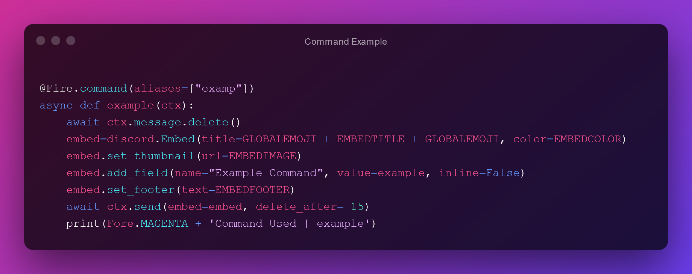

# Fire SelfBot 🔥

---

#### Next way to support skids 😉

---

> A Discord SelfBot written in Python with many features.
> Features include NitroSniper, Auth System and Auto updater.

---

##### Prerequisites

---

```
Python >=3.7 - pip >= 3.7
```

##### Install

---

```
pip install -r requirements.txt
```

##### Usage

---

```
python Fire.py
```

> Or use the exe file in the zip.

##### Changelog

---

```toml
Changelog 24.05.21:
    [+] Bug fixes
    [+] Meme rest api
    [+] Toys meme  [for rest api]
pip install -r requirements.txt
```
```toml
Changelog 01.06.21:
    [+] Bug fixes
    [+] set thme command
    [+] theme list command
    [+] autoupdater
```
```toml
Changelog 11.07.21:
    [IMPORTANT] With this update i close this project!
    [+] Auth System APi by [EinTim](https://github.com/EinTim23)
    [+] Version with own auth


##### Code

---




